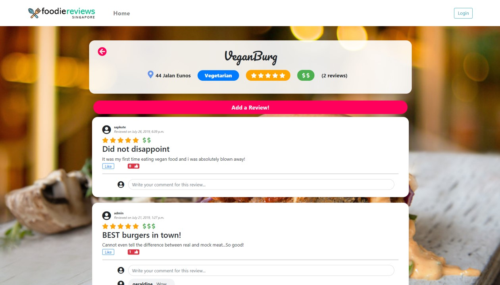
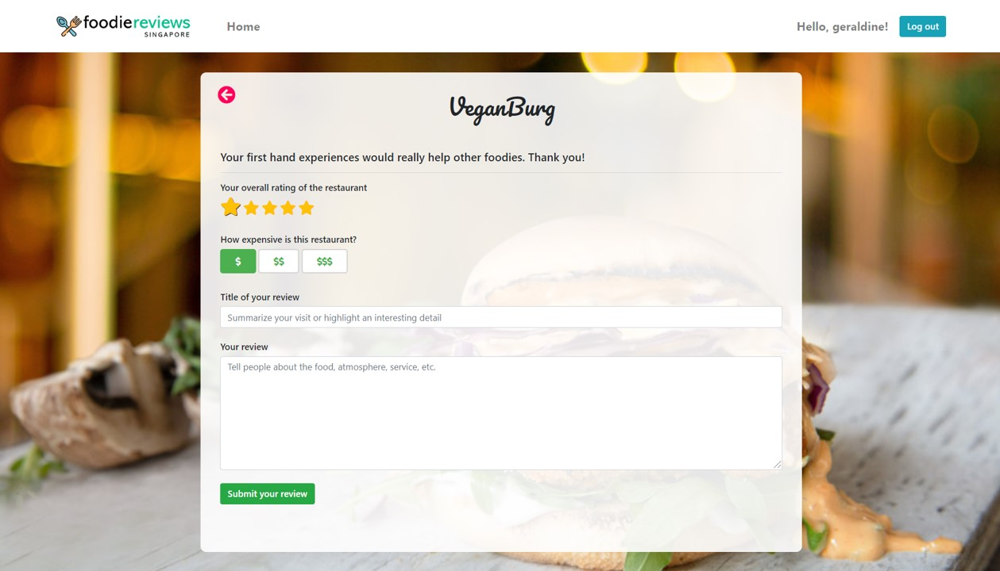
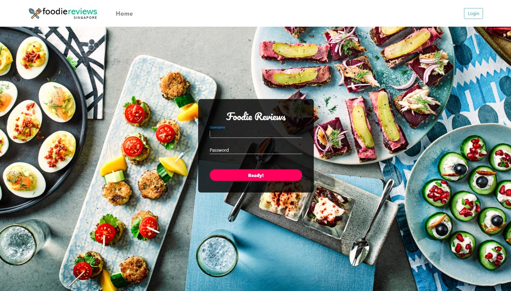

# Food Reviews App
A Django Web App built with the National University of Singapore, Institute of Systems Science. 

## GIF Walkthrough

## Screenshots

## Contributions
- Geraldine
- Saphira
- Natalie

## Features
- Browse restaurant by categories
- For each restaurant, view details, reviews and comments to the reviews 
- Login as member for the following 2 additional features
- Add reviews to a resturant (star rating, price rating, review title and description)
- Like a review
- Add comments to a review (replies are indented)
- Add replies to comment (commens are indented)

## Technical Accomplishments
* Extensive use of AJAX with Django REST framework
    * List of restaurants by category
    * Like review
    * Add comment
    * Add reply
* Upon successful AJAX response, append new comment/ reply to DOM
    * Efficient HTML DOM structure
* Modularization of code for reusability
* Clean project directory (Separation of concerns)

## Running the project
- Install python, django (and Anaconda prompt if running on Windows)
- In Anaconda prompt, use `python manage.py migrate` once to create database tables, then run django server using `python manage.py runserver 0.0.0.0:8000`. The optional argument `0.0.0.0:8000` allows other computers to access your development server over the network.
- Open browser and enter url `localhost:8000/reviewapp`
