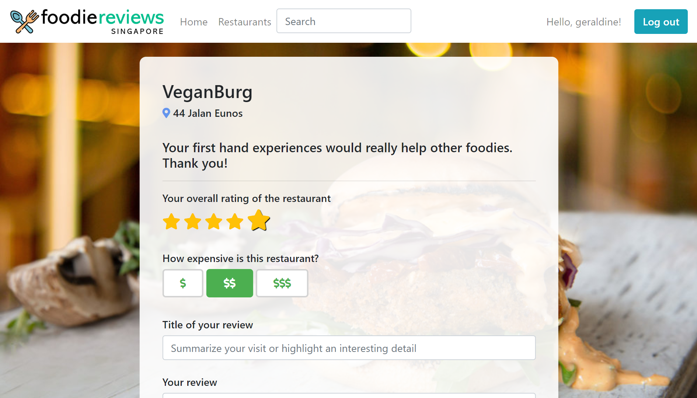
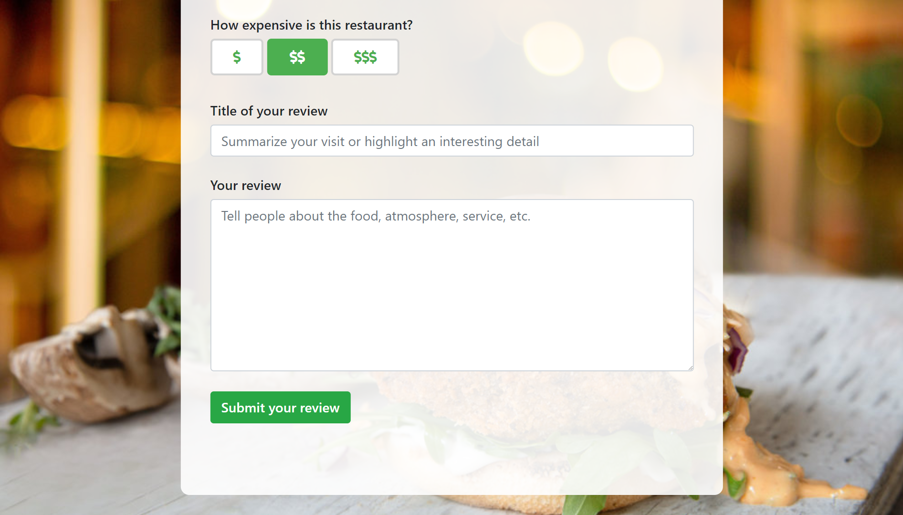

# Food Reviews App
A Django Web App built with the National University of Singapore, Institute of Systems Science. 

## Screenshots

## Contributions
- **Saphira:** Restaurant Details
- **Natalie:** Browsing by Categories, Browsing within Category
- **Geraldine:** Add Review module, Authentication, Master page

## Features
- Browse restaurant by categories
- Browse list of restaurants within the selected category
- For each restaurant, view details, reviews and comments to the reviews 
- Login as member for the following 2 additional features
- Add reviews to a resturant (star rating, price rating, review title and description)
- Add comments to a review (like button, replies are indented)

## Running the project
- Install python, django (and Anaconda prompt if running on Windows)
- In Anaconda prompt, use `python manage.py migrate` once to create database tables, then run django server using `python manage.py runserver 0.0.0.0:8000`. The optional argument `0.0.0.0:8000` allows other computers to access your development server over the network.
- Open browser and enter url `localhost:8000/reviewapp`
